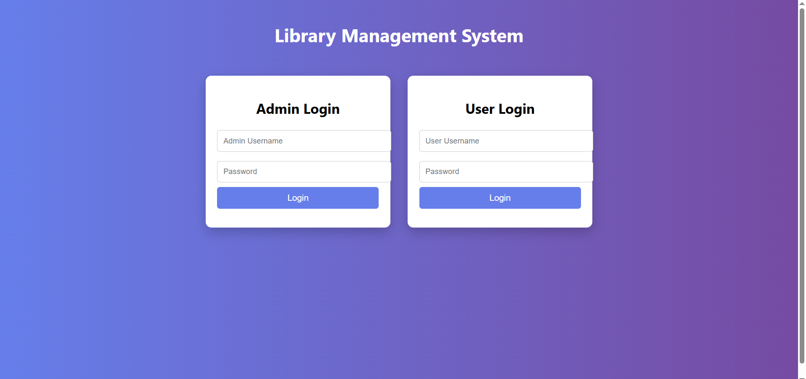
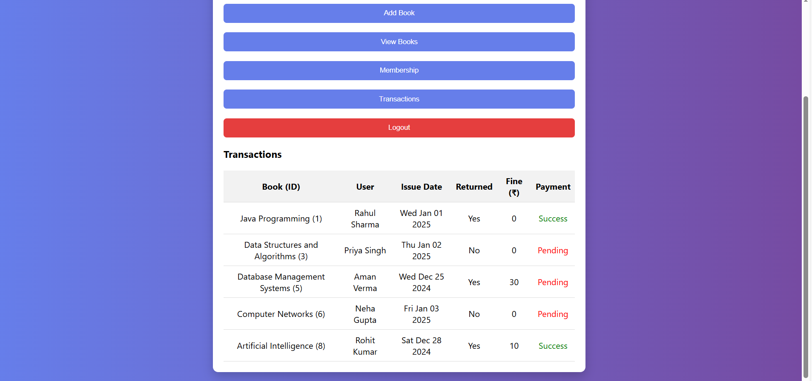

# 📚 Library Management System

A browser-based **Library Management System** developed using **HTML, CSS, and JavaScript** as part of an academic / placement technical assessment.

---

## 🔐 Demo Login Credentials

### 👨‍💼 Admin Login
- **Username:** admin  
- **Password:** admin123  

### 👤 User Login
- **Username:** user  
- **Password:** user123  

> Note: These are demo credentials for evaluation purposes only.

---

## ✨ Features

- Separate **Admin** and **User** Login
- Add and View Books
- Membership Management
- Book Issue and Return
- Transaction Management
- Fine Calculation
- Payment Status (Success / Pending)
- Clean and Responsive UI

---

## 🛠️ Technologies Used

- HTML  
- CSS  
- JavaScript  

---

## 🚀 How to Run the Project

1. Download or clone the repository  
2. Open `index.html` in any modern web browser  
3. Use the demo credentials to explore Admin and User features  

---

## 📸 Screenshots

### Login Page

### user Dashboard

### Transactions Section

---

